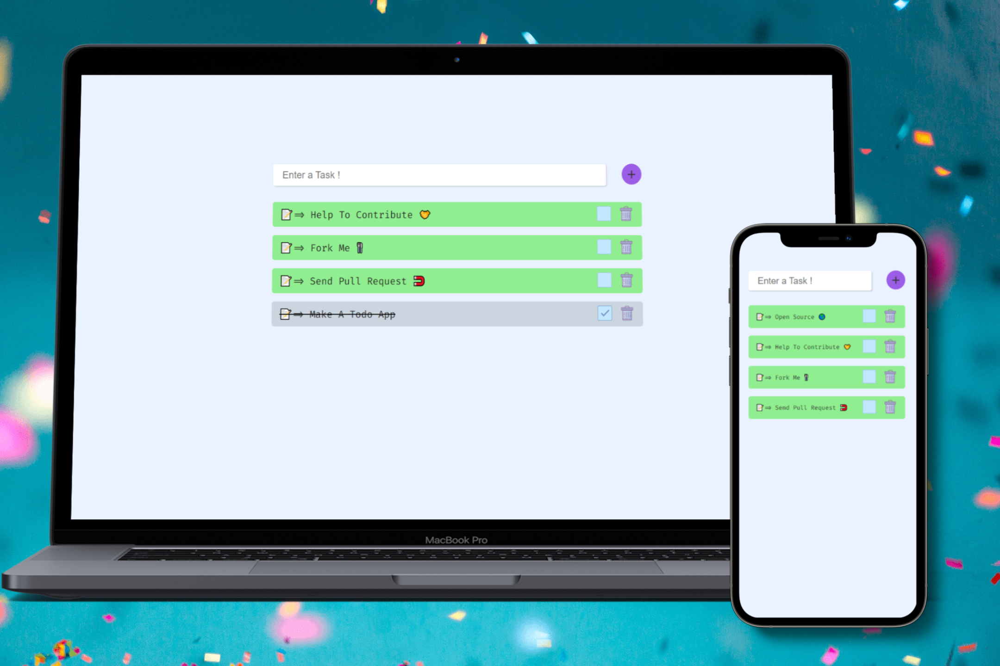

# ToDo Angular ✔

### Check it out [here]!

 

## Overview 👀

- A simple To-Do list web app to keep a track of things you gotta do
- This web app makes no request to external/backend servers for storing data but instead stores data on local machines
- Fully responsive site

## WIP 🛠

- Adding edit functionality
- Adding gesture events
- Mobile APP (PWA)

## How To Contribute🤝

- Yes,it is open source you can clone and change code to your need.
- Most of the code is self explanatory, anyhow
- for any clarification on code or want to contribute contact
- [Gmail] / [Twitter] /[LinkedIn]

[gmail]: mailto:makodehrushikesh@gmail.com
[linkedin]: https://www.linkedin.com/in/hrushikesh-makode-75116a147/
[twitter]: https://twitter.com/HrushiMakode
[here]: https://hrushi-makode-ng-todo.netlify.app/
